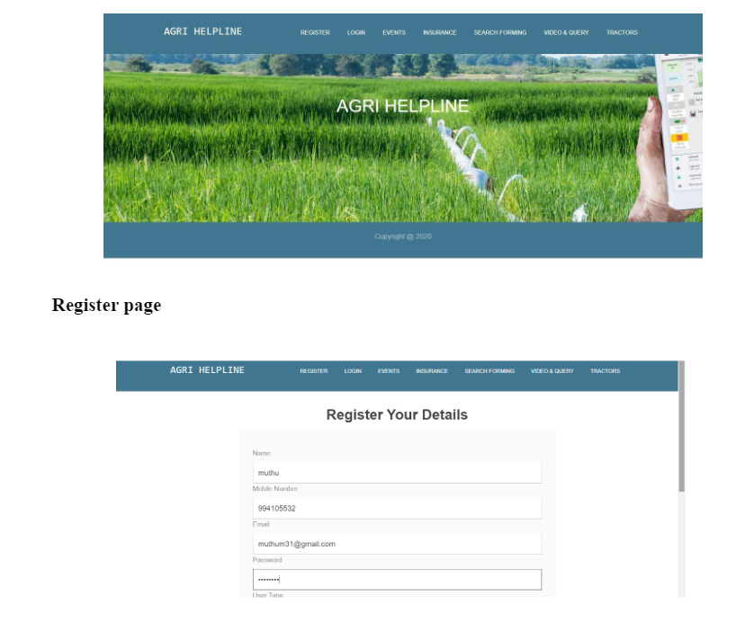

#Agriculture Helpline Website 🌾

I completed the project while working as an Intern in Nitroware Technologies

##About the project
- This project, titled "Agri Helpline," is aimed at revolutionizing agriculture information management using Python Django framework, HTML, BOOTSTRAP, CSS, and SQLite as the backend database.
- The website provides a comprehensive platform for farmers, offering details on government loans, insurance, crop and stock information, and weather-based advisories.
- The user-friendly interface allows quick access to essential information, fostering efficiency in decision-making for farmers.
- Special features include a rental tractor service that users can access by enrolling on the helpline, consultation services with agriculture experts, and a forum for farmers to share knowledge and ask questions.
- The system follows the Mobile First methodology, ensuring compatibility with all devices and a visually appealing design for a pleasant user experience.
- This responsive agriculture helpline website is a one-stop solution, catering to the diverse needs of planters, importers, exporters, prospective investors, and researchers in the agricultural sector.

##Problem Description
- The Agri Helpline website addresses the challenges faced by farmers in the existing manual system.
- The need for a more efficient and cost-effective solution led to the development of this software.
- The manual process involved receptionists using pen and paper to gather data, leading to difficulties in data maintenance and retrieval.
- The new system eliminates these challenges by automating data entry and storage, significantly reducing space consumption and costs.
- The overarching goal is to streamline the management of agricultural information, providing a modern, user-friendly solution for the farming community.

- 
